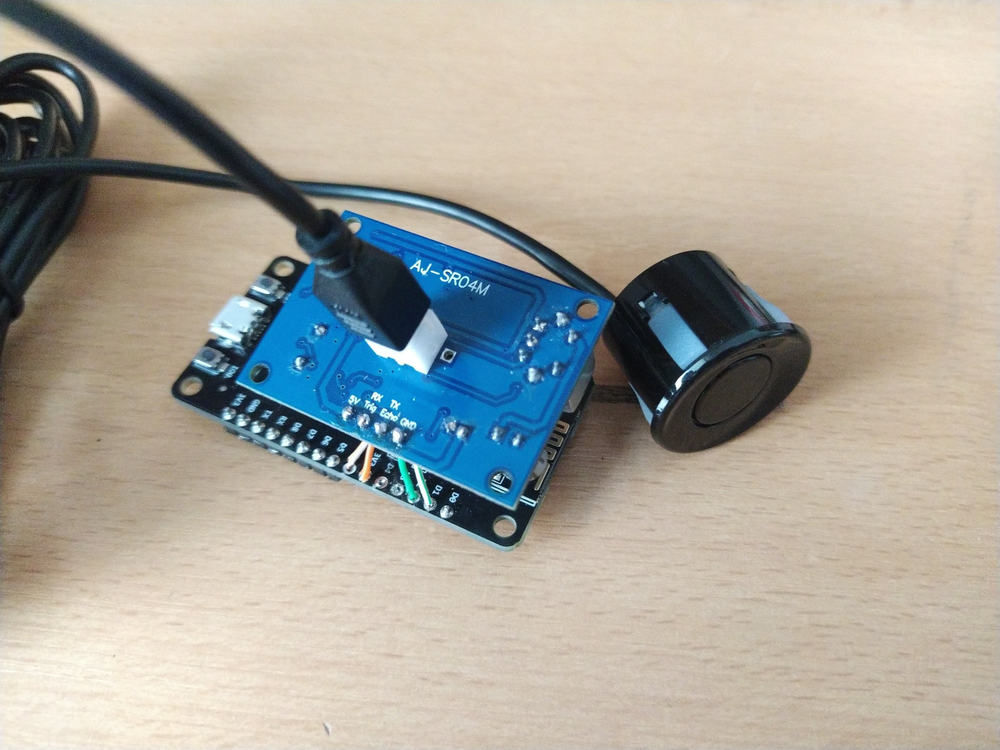
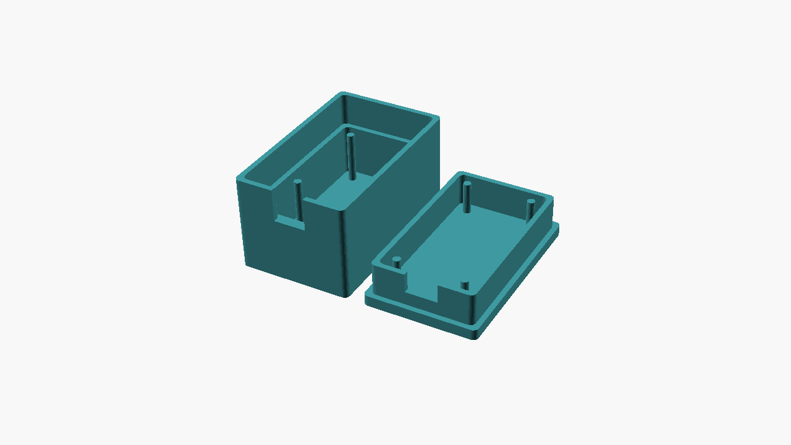
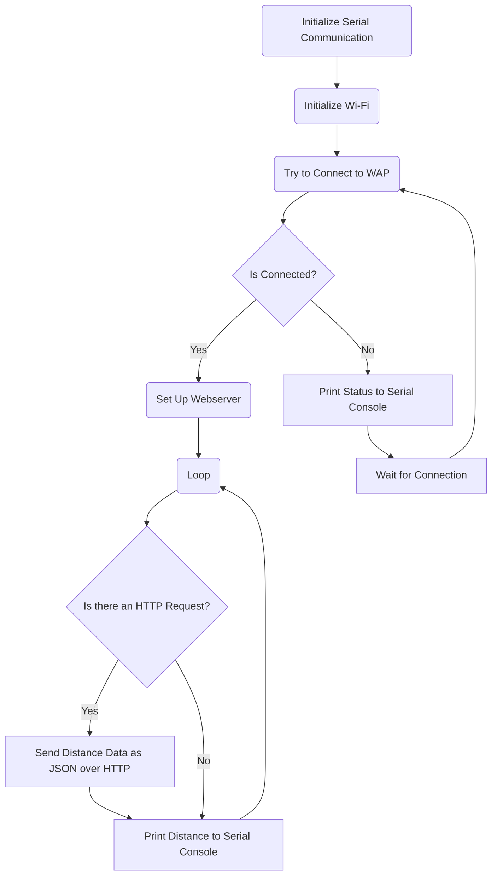

# ESP8266 distance measurement

## Case

[STL File](./Case.stl) [SCAD file](./Case.scad)

## Arduino Code Logic

```mermaid
flowchart TD
    A("Initialize Serial Communication") --> B("Initialize Wi-Fi")
    B --> C("Try to Connect to WAP")
    C --> D{"Is Connected?"}
    D -->|Yes| H("Set Up Webserver")
    D -->|No| F["Print Status to Serial Console"]
    F --> G["Wait for Connection"]
    G --> C
    H --> I("Loop")
    I --> J{"Is there an HTTP Request?"}
    J -->|Yes| K["Send Distance Data as JSON over HTTP"]
    J -->|No| M["Print Distance to Serial Console"]
    K --> M
    M --> I
```
